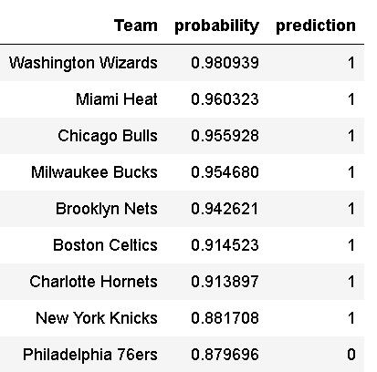

# NBA Playoff Predictor

## Background Information
The NBA season has thirty teams consisting of two divisions, East and West. Each team plays 82 games, 41 home and 41 away. Until 2021, the top 8 teams from each division went on to the playoffs. Now there is a play-in tournament between ranks 7 through 10 to compete for the last two playoff spots.
I used three different models to predict which teams will make the playoffs and compared accuracy. 

I started my data collection starting from the 1979-80 season because the NBA added the three point line during that season, which fundamentally changed the way basketball is played.

## Source Data
I decided to utilize [basketball-reference.com](https://basketball-reference.com/) because of its 
 - easy to understand tables
 - comprehensive stats
 - high accuracy

## 2022 Prediction Results

#Acknowledgements
Data Scraper - modified from Heian Lee's [data scraper](https://github.com/hanesy)
